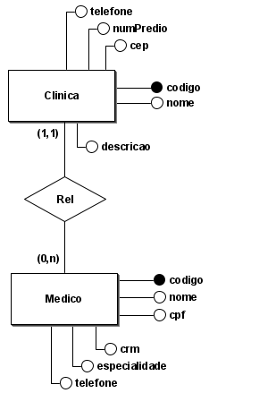

# :medical_symbol: **API para gestão de clínicas e corpo médico**

Bernardo Tomasi • IFSUL • 2024

## :bookmark_tabs: Sumário
### [Sobre](#information_source-sobre_o_app) • [Tecnologias](#gear-tecnologias) • [Diagrama ER](#file_folder-estrutura_do_diagrama_er) • [Recursos](#heavy_check_mark-recursos) • [Configuracoes](#rocket-configuracoes)
# :information_source: Sobre o App
A API desenvolvida utilizando Express e PostgreSQL que gerencia as informações de clínicas e médicos de um sistema hospitalar. O sistema gerencia as entidades "Clínica" e "Médico", onde cada médico está associado a uma única clínica.

# :gear: Tecnologias

# :file_folder: Estrutura do Diagrama ER

Atributos da clínicas:
- codigo (Chave Primária)
- nome
- telefone
- numPredio
- cep
- descricao
- Relacionamento: Cada clínica pode ter vários médicos associados (relação 1 para muitos).

Atributos de médicos: 
- codigo (Chave Primária)
- nome
- cpf
- telefone
- crm
- especialidade

Relacionamento: Cada médico deve estar associado a uma única clínica (relação muitos para 1).

# :heavy_check_mark: Recursos
A API permite a criação, leitura, atualização e exclusão (CRUD) de registros de clínicas e médicos. Além disso, ela gerencia o relacionamento entre médicos e clínicas. Abaixo estão as principais rotas e suas funcionalidades:

## Rotas de Clínica
- POST /clinicas: Cria uma nova clínica.
- GET /clinicas: Retorna uma lista de todas as clínicas.
- GET /clinicas/: Retorna os detalhes de uma clínica específica.
- PUT /clinicas/: Atualiza as informações de uma clínica existente.
- DELETE /clinicas/: Remove uma clínica do sistema.

## Rotas de Médico
- POST /medicos: Cria um novo médico e associa a uma clínica.
- GET /medicos: Retorna uma lista de todos os médicos.
- GET /medicos/: Retorna os detalhes de um médico específico.
- PUT /medicos/: Atualiza as informações de um médico existente.
- DELETE /medicos/: Remove um médico do sistema.

# :rocket: Configuracoes
- Faça o download ou clone o repositório
- No diretório do projeto, acesse a paste "src"
- Em seu terminal, digite `npm start`
- Interaja com a API pelo localhost:3003

[↑ Back to top](#compass-compass)
